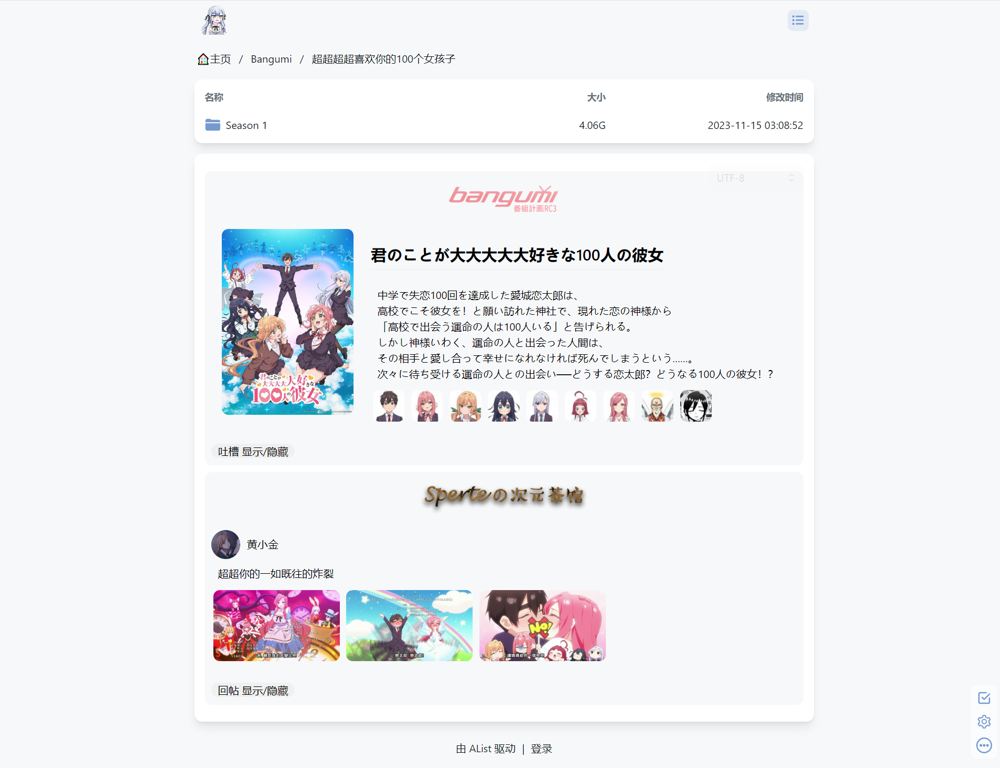

# 爬取帖文生成器

[English](./README.en.md) | [简体中文](./README.md)

主要用于AList。通过`crawl_info.json`控制其爬取网页，并将生成的内容保存在AList挂载文件夹的readme.md里，以实现在AList打开文件夹时显示介绍内容

支持自定义爬取策略与样式模板，以实现多个网站的爬取与生成

支持评论的爬取与显示

支持响应式布局





## 使用方法

确保已经安装BeautifulSoup：`pip install beautifulsoup4`

配置`setting.py`，正确映射爬取策略与样式模板映射字典，并设置保存爬取信息的json文件的路径。

如果有自定义的爬取策略与样式模板模块，可以在此添加。样式模板中的'default': default_template,不能修改


创建`crawl_info.json`文件，通过它控制爬取与保存，其中的"source": "来源"，要与爬取策略和样式模板的映射字典键对应

```
[
    {
        "saveFile": "/保存路径/readme.md",
        "urlList": [
            {
                "source": "来源",
                "url": "网页链接"
            }
        ]
    }
]
```

 

执行python脚本`main.py`开始运行

**小技巧**

可在执行`main.py`时传参传入`crawl_info.json`文件的路径，此时会以这个路径获取爬取信息

可以将`crawl_info.json`放在AList挂载的文件夹以方便修改

通过多个`crawl_info.json`文件与计划任务，可以以不同的周期更新内容。比如将23年十月的新番都写在`crawl_info_23十月.json`，在其完结后就可以方便的控制其更新频率。


## 扩展

通过在 `my_crawlers`包 和 `my_templates`包 添加模块来添加自定义爬取策略与样式模板。添加完毕后要在`setting.py`中正确映射。

**爬取策略：**添加自定义模块`xxx_crawler.py`，其main函数要接收一个网页的链接来爬取网页，并返回一个存放着帖子数据的字典。

```python
threadData = {
    'SOURCE_URL': '来源网站的链接',
    'SOURCE_IMG': '来源网站的图标',
    'SOURCE_NAME': '来源网站的名称',
    'THREAD_URL': '帖子的链接',
    'TOGGLE_ID': '用于回帖的显示与隐藏，不能重复 可以使用帖子id或随机数',
    # 主帖
    'myMainPost': { 
        'POST_USER_URL': '主贴链接',
        'POST_USER_IMG': '用户头像',
        'POST_USER_NAME': '用户名',
        'POST_CONTENT_P': '帖子内容',
        'myPostImgs': [
            {'POST_CONTENT_IMG':'帖子的图片'},
        ]
    }, 
    # 回帖列表
    'myRePosts': [
        {'POST_USER_URL': '主贴链接',
         'POST_USER_IMG': '用户头像',
         'POST_USER_NAME': '用户名',
         'POST_CONTENT_P': '帖子内容',
         'myPostImgs': [
            {'POST_CONTENT_IMG':'帖子的图片'},
        ]},
    ]
}
```

字典中以 大写字母+下划线 的键值可以自定义（可以添加或删除），务必与模板中对应。

**样式模板：**添加自定义模块`xxx_template.py`，要有以下五个字符串，请参考其他的模板

```python
# 自定义css
customCssOfHtml = ''''''
# 主题帖的模板
threadOfHtml = ''''''
# 主贴的模板
mainpostOfHtml = ''''''
# 回贴的模板，视情况可以与主帖相同
repostOfHtml = ''''''
# 每个图片的模板
imgOfHtml = ''''''
```

